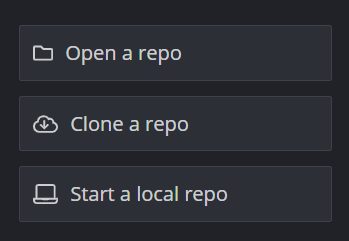
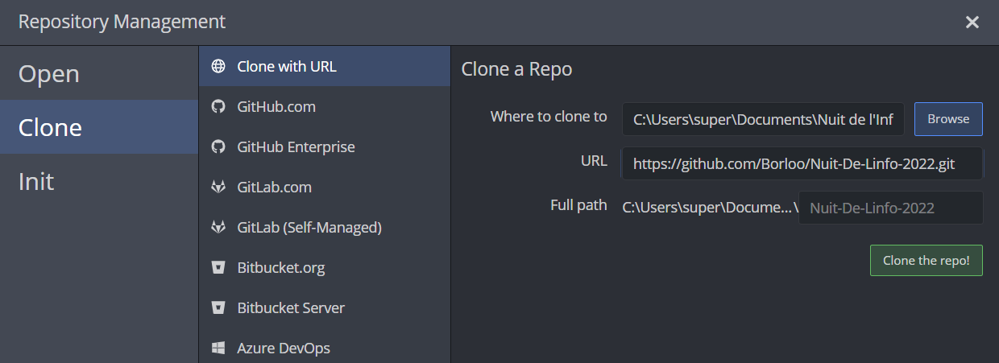

# Nuit De L'info 2022

## Ca Marche Même Plus En Local

### Récupération du projet en local

Ligne de commande : 

```bash 

git clone https://github.com/Borloo/Nuit-De-Linfo-2022.git

```

GitKraken :





### Créer une nouvelle branche

- Pour dev :

Ligne de commande : 

```bash

git checkout develop
git checkout -b feature/name_feature
git 

```
